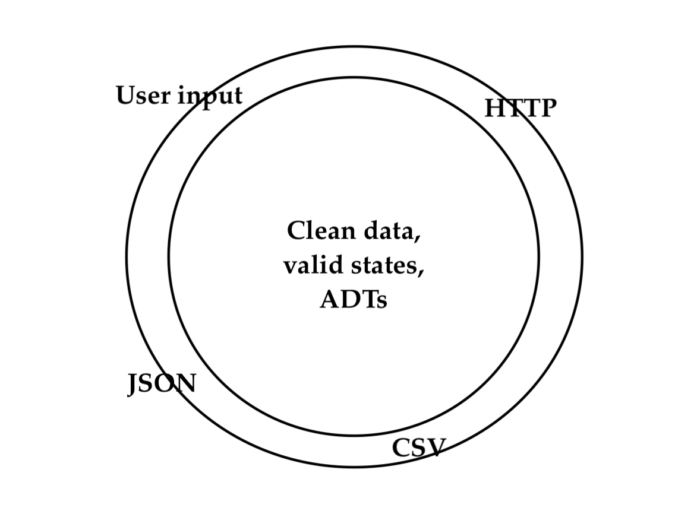

# Algebraic Data Types (ADTs)

---

```scala
def describeTrafficLight(trafficLight: String) = 
  trafficLight match {
    case "red"    => "Stop!"
    case "yellow" => "Slow down..."
    case "green"  => "Safe to go."
    case _        => "Invalid." // shouldn't happen
  }
```

Gotta test the invalid case!

```scala
assert(describeTrafficLight("abc") == "Invalid.")
```

--- 

```scala
def nextTrafficLight(trafficLight: String) = 
  trafficLight match {
    case "red"    => "green"
    case "yellow" => "red"
    case "green"  => "yellow"
    case _        => "Invalid." // shouldn't happen
  }
```

Gotta test the invalid case!

```scala
assert(describeTrafficLight("abc") == "Invalid.")
```

--- 

```scala
def saveTrafficLight(trafficLight: String)

def logTrafficLight(trafficLight: String)

def trafficLightAsJson(trafficLight: String)

def trafficLightAsCsv(trafficLight: String)
```

`String` implies that the complete works of Shakespeare is valid input.

Including the Chinese translations!

---

# Let's solve this with types!

---


---

```scala
sealed trait TrafficLight

case object Red extends TrafficLight

case object Yellow extends TrafficLight

case object Green extends TrafficLight
```

...and nothing else!

(unlike traditional inheritance)

---

```scala
def describeTrafficLight(trafficLight: TrafficLight) = 
  trafficLight match {
    case Red    => "Stop!"
    case Yellow => "Slow down..."
    case Green  => "Safe to go."
  }
```

vs.

```scala
def describeTrafficLight(trafficLight: String) = 
  trafficLight match {
    case "red"    => "Stop!"
    case "yellow" => "Slow down..."
    case "green"  => "Safe to go."
    case _        => "Invalid." // shouldn't happen
  }
```

Possible inputs: 3 vs. _Infinity_

---


```scala
def nextTrafficLight(trafficLight: String) = 
  trafficLight match {
    case "red"    => "green"
    case "yellow" => "red"
    case "green"  => "yellow"
    case _        => "Invalid." // shouldn't happen
  }
```
vs.
  
```scala
def nextTrafficLight(trafficLight: TrafficLight) = 
  trafficLight match {
    case Red    => Green
    case Yellow => Red
    case Green  => Yellow
  }
```

Possible inputs: 3 vs. _Infinity_

---

## New traffic light?

```scala
sealed trait TrafficLight

case object Red extends TrafficLight

case object Yellow extends TrafficLight

case object Green extends TrafficLight

case object Blue extends TrafficLight
```

---



---
